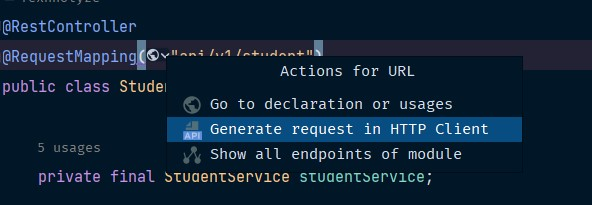
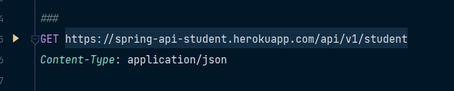
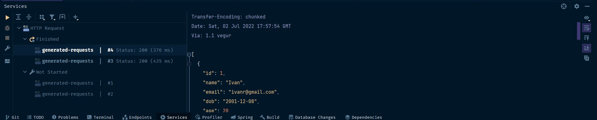

# Backend Spring boot
Esta solo es una pequeña api con solo 4 endpoints.

## Consultar API
***
Esto se puede consultar mediante PostMan o en caso tener la version ultimate de IDEA Intellij.


Una vez se haya generado el archivo, puedes copiar y pegar los comandos dentro del archivo


Solo debes dar click en el play y debe salir un output similar a este.


## EndPoint
***
Este ENDPOINTS solo regresa unos pocos usuarios dentro de la base de datos

`GET https://spring-api-student.herokuapp.com/api/v1/student`

Con este ENDPOINTS se puede agregar un nuevo usuario.

`POST http://localhost:8080/api/v1/student`

Ejemplo:
```
{
  "name":"usuario_1",
  "email": "usuario_1.32@gmail.com",
  "dob":"2000-11-20"
}
```

Con este ENDPOINTS se puede eliminar un usuario mediante un `id`.

`DELETE http://localhost:8080/api/v1/student/1`

Con este ENDPOINTS se puede modificar un usuario mediante un `id`, en caso que quieras modificar
solo debe cambiar `name=unNombre` y `email=correo@gmail.com`.

`PUT https://spring-api-student.herokuapp.com/api/v1/student/4?name=Carmen&email=Carme@gmail.com`

No necesario modificar las dos variables puedes modificar solo uno.

`PUT https://spring-api-student.herokuapp.com/api/v1/student/5?name=Uriel`

